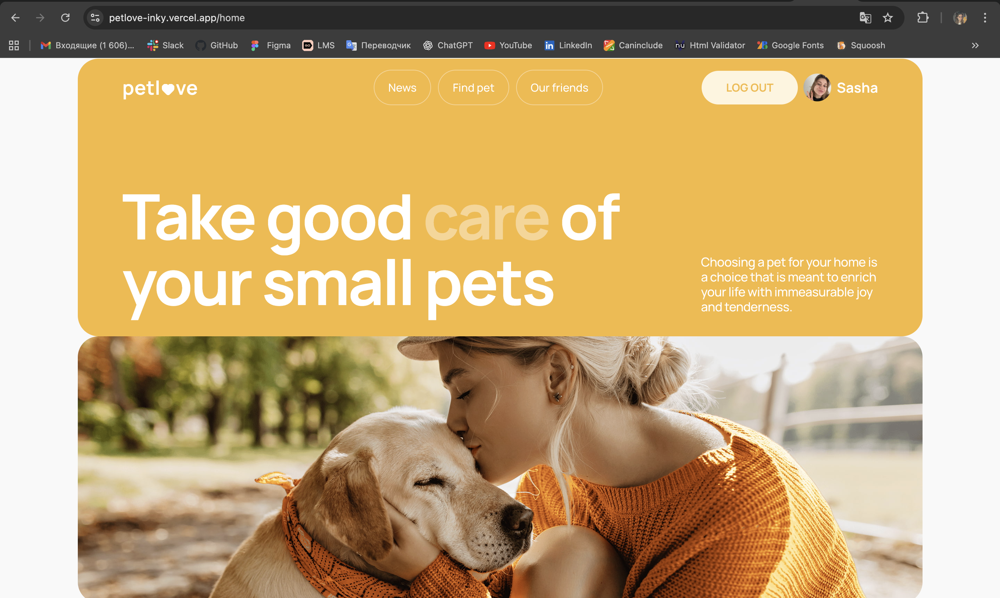

# PetLove


PetLove is a fully responsive web application for exploring pet adoption notices, managing a personal profile, tracking favorite listings, and adding your own pets.
The project is built according to a detailed Figma design and uses a ready-made REST API.

---

## 🚀 Live Demo

https://petlove-inky.vercel.app

---

## 📌 Overview

PetLove provides a modern and intuitive platform where users can:

- browse daily animal-related news;
- view and filter pet adoption notices;
- save favorite pets;
- explore detailed information through modals;
- create and manage a personal profile;
- add, view and delete their own pets.

The application ensures smooth UX, mobile-first responsiveness and reliable form validation.

---

## ✨ Features

### 🔐 Authentication

- Registration and Login with validation;
- Auto-login after successful registration;
- Private route protection;
- Logout with confirmation modal.

### 📰 News

- Keyword search;
- Server-side pagination;
- External "Read more" links.

### 🐾 Notices

- Filtering by category, sex, type, location, popularity and price;
- Dynamic location search using `react-select`;
- Server-side pagination;
- Favorite/unfavorite functionality;
- Detailed modal with full pet information.

### 👤 User Profile

- Edit user data: name, email, avatar, phone;
- View favorite notices and recently viewed notices;
- Remove notices from favorites;
- Delete pets added by the user.

### ➕ Add Pet

- Fully validated form;
- URL validation for pet image;
- Datepicker for birthday;
- Redirect to profile after saving.

### 🍔 Header and Navigation

- Fully responsive layout;
- Burger menu on tablet and mobile;
- Different navigation for guests and authenticated users;
- Active route highlighting.

---

## 🛠 Tech Stack

### Frontend

- **React** (Vite)
- **Redux Toolkit** + Async Thunks
- **React Router**
- **react-hook-form** + **Yup**
- **react-select**
- **react-datepicker**
- **CSS Modules**

### Additional Tools

- Axios API client;
- SVG sprite system;
- Toast notifications;
- Retina image optimization.

---

## 📁 Folder Structure

```
├── public/ # static files
├── screenshots/ # images for README (preview screenshots)
├── src/
│ ├── api/ # axios client & API endpoints
│ ├── assets/ # images, icons, sprite
│ ├── components/ # reusable UI components
│ ├── hooks/ # custom hooks
│ ├── pages/ # route-level pages
│ ├── redux/ # Redux Toolkit slices & store
│ ├── routes/ # private/public route wrappers
│ ├── App.jsx # main app layout
│ ├── index.css # global styles
│ └── main.jsx # application entry point
├── .gitignore
├── eslint.config.js
├── index.html
├── package.json
├── package-lock.json
├── README.md
└── vite.config.js
```

## 🔧 Installation

```sh
npm install
npm run dev
```

## 📦 Build

```sh
npm run build
```

## 🌍 API Reference

Backend documentation:
https://petlove.b.goit.study/api-docs/

---

## 🧭 Roadmap

- [x] Full authentication flow
- [x] Profile page
- [x] Add pet feature
- [x] Notices filters & pagination
- [x] Favorites & Viewed
- [ ] Dark mode
- [ ] Image upload instead of URL
- [ ] PWA support
- [ ] Infinite scroll option

---

## 💡 Future Improvements

These enhancements could elevate the UX further:

- Optimistic UI updates (favorites, deletion)
- Saving filters in URL query parameters
- Better skeleton loaders
- Improved global error boundary
- Accessibility improvements (ARIA labels, focus traps)

---

## 📸 Screenshots

Below are several preview screens demonstrating the main parts of the application.

### Home (Hero Section)


### Home (Main Content)



### Profile Page


## 👩‍💻 Author

**Oleksandra Bondaruk**  
Frontend Developer
